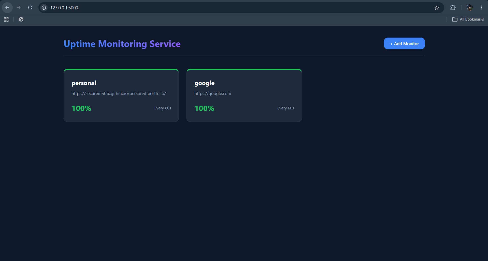

# Uptime Monitoring Service

A full-stack uptime monitoring platform that continuously checks website availability, tracks response times, stores historical monitoring data, and provides a modern web dashboard for real-time monitoring.

## Preview



---

## Features

### Monitoring
- Monitor websites and API endpoints
- Configurable monitoring intervals
- Automatic uptime checks
- Response time tracking
- HTTP status monitoring

### Dashboard
- Real-time monitoring dashboard
- Uptime percentage tracking
- Downtime incident reporting
- Average response time analytics
- Historical monitoring data

### Monitoring Engine
- Asynchronous monitoring using `aiohttp`
- Background scheduling with `APScheduler`
- Concurrent endpoint checks
- Automatic status updates

### Data Storage
- SQLite database
- Monitor configuration storage
- Historical uptime records
- Performance metrics tracking

### Alerts
- Downtime detection
- Alert cooldown system
- Extensible notification architecture

---

## Preview Screenshot


---

## Tech Stack

### Backend
- Python
- Flask
- APScheduler
- aiohttp
- SQLite

### Frontend
- HTML
- CSS
- JavaScript

---

## Project Structure

```text
uptime-monitoring-service/
│
├── assets/
│   └── dashboard-preview.png
│
├── static/
├── templates/
│
├── app.py
├── monitor.py
├── scheduler.py
├── alerts.py
├── database.py
├── models.py
│
├── requirements.txt
├── README.md
└── .gitignore
```

## Installation

Clone the repository:

```bash
git clone https://github.com/securematrix/uptime-monitoring-service.git
cd uptime-monitoring-service
```

Create a virtual environment:

```bash
python -m venv venv
```

Activate it:

### Windows

```bash
venv\Scripts\activate
```

### Linux/macOS

```bash
source venv/bin/activate
```

Install dependencies:

```bash
pip install -r requirements.txt
```

---

## Running the Application

Start the server:

```bash
python app.py
```

Open:

```text
http://127.0.0.1:5000
```

---

## Example Monitors

```text
https://google.com
https://github.com
https://openai.com
https://securematrix.github.io/personal-portfolio/
```

---

## Future Improvements

- Email notifications
- Webhook alerts
- SMS alerts
- User authentication
- PostgreSQL support
- Docker deployment
- Public status pages
- SSL certificate monitoring
- Multi-user support

---

## Learning Outcomes

This project demonstrates:

- Full-stack web development
- Asynchronous programming
- Task scheduling
- Database design
- Monitoring systems architecture
- Dashboard development
- Performance tracking and analytics

---

## License

MIT License
